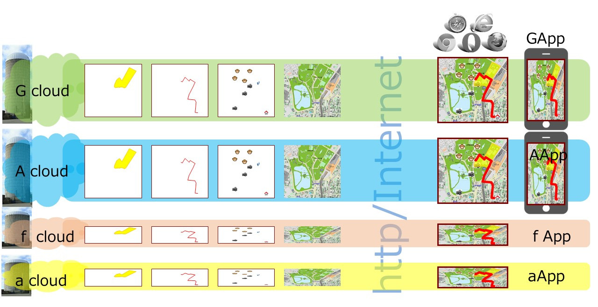
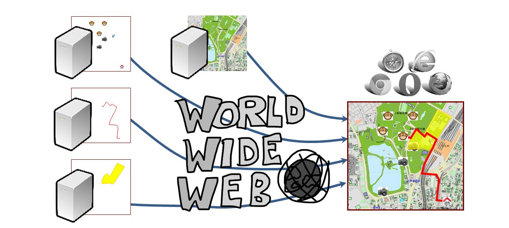
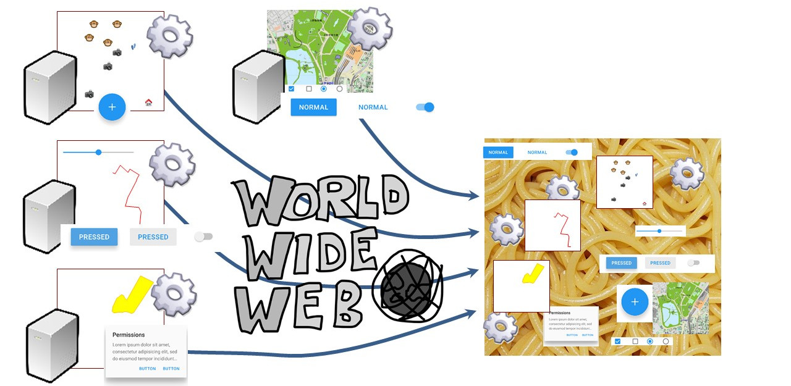
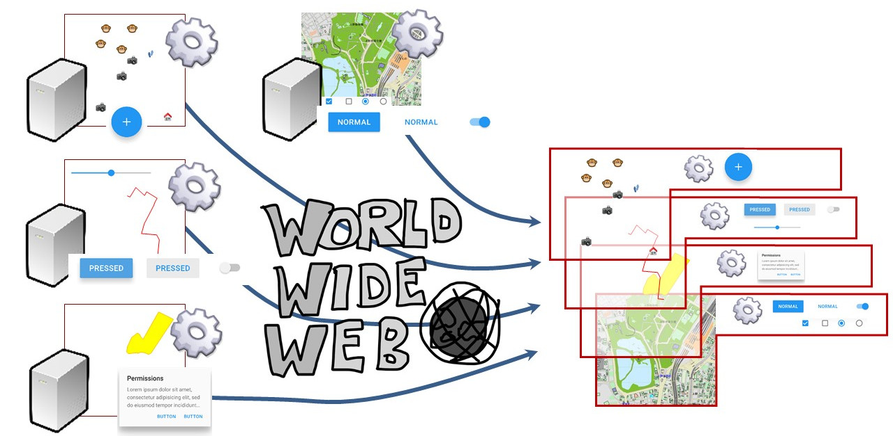
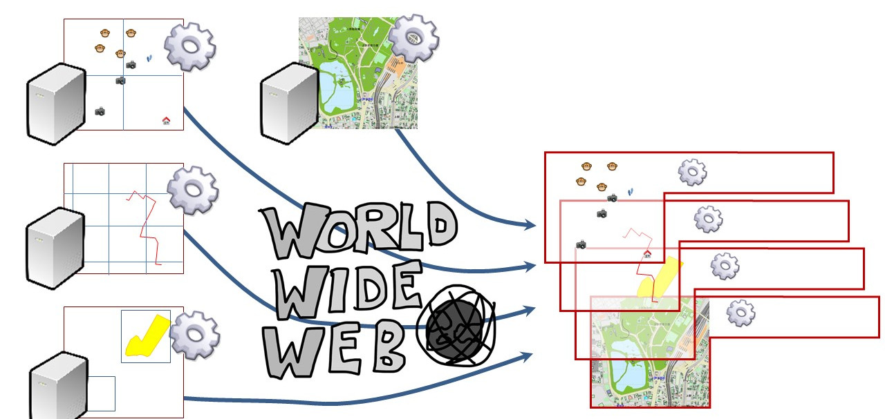
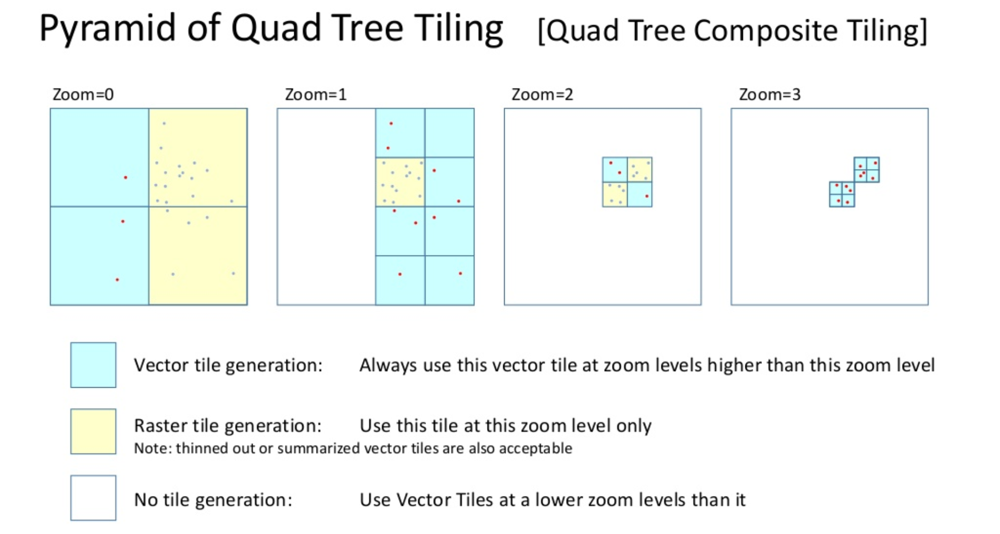

# Overview
I have been developing and standardizing SVG based web Mapping system for almost 20 years.
During this time, map services have evolved as silo-type by various IT vendors. Even mapping frameworks that looks like open source provided by venture companies, the cloud-side services remains silo.

From the very beginning, I have believed that the following decentralized type is "Web" Mapping.

Can we see any signs of a change to decentralized Web Mapping?

# Urgent demand
- Social infrastructure operator companies and local governments, such as mobile phone operators like us, widely use various other social infrastructure operational information and weather / geological information to deal with large-scale accidents and natural disasters. In view of the independence of business, this activity is preferably the decentralized system rather than relying on an aggregator company.
- According to [gartner's latest hype cycle for emerging technologies 2019](https://www.gartner.com/smarterwithgartner/5-trends-appear-on-the-gartner-hype-cycle-for-emerging-technologies-2019/), deentralized information technologies has been newly introduced, against the backdrop of various social situations.
- Needless to say, companies and governments are responsible for the provision of social infrastructure operational status and weather information to citizens.

# ISSUES
- Discontinuity between geo and web industry, geo engineers and web engineers, resulting in technology and spec mismatch
  - From my point of view, the geo community in particular seems to stick to industry business models and industry-specific concepts.
- There seems to be no business model for decentralized Web Mapping, especially for current web browser vendors.

# KDDI's submission and de-jure standardization regarding Web Mapping based on browser's native graphics scripting language and rendering systems
- [Memmber submission](https://www.w3.org/Submission/2011/04/) on 7th day of June, 2011 to W3C
  - [Tiling and Layering Module for SVG 1.2 Tiny](https://www.w3.org/Submission/2011/SUBM-SVGTL-20110607/)
- JIS (Japan's Industrial Standard)
  - X.7197 - Geographic Information -- Map representation and services based on SVG 
    It is equivalent specification to Tiling and Layering Module for SVG 1.2 Tiny. It also describes the correspondence between geospatial information definition in ISO TC211 and geographic data representation by SVG. [Link1](https://webdesk.jsa.or.jp/books/W11M0090/index/?bunsyo_id=JIS%20X%207197:2012), [Link2](https://kikakurui.com/x7/X7197-2012-01.html)
  - X.4197 - SVG Tiny 1.2 
    It is Japanese Translation of SVGT1.2) [Link1](https://webdesk.jsa.or.jp/books/W11M0090/index/?bunsyo_id=JIS%20X%204197:2012), [Link2](https://kikakurui.com/x4/X4197-2012-01.html)

# Updated features of SVG based Mapping
## Decentralized web mapping application - Web applications as Layers
Web Mapping Apps with a large number of layers are often controlled by complex spaghetti javascript logic. Such huge and complex apps are not only maintenance issues but also centralized.

Many javascript logic can be encapsulated in layers if organized. Layers with UI are also beyond the concept described above.imgs/

## Various tiling logic with Web Apps
The tiling scheme being developed at this stage within the geo community is not permanent. There are many challenges. For example, there are potentially many specifications for ERR404 and URL restrictions.
We prefer to be able to extend this as an application rather than putting such a still unstable method in the core.

### Another more efficient tiling scheme example
We operate an efficient tiling scheme called Quad Tree Composite Tiling. Of course it is open source.
**[Slide for Quad Teee Composite Tiling](https://www.slideshare.net/totipalmate/quad-tree-composite-tiling-in-english)**

