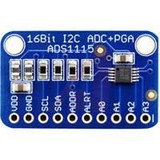
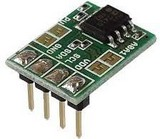
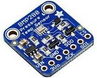
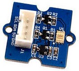
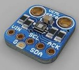
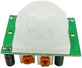

# [Web GPIO](https://github.com/browserobo/WebGPIO) and [Web I2C](https://github.com/browserobo/WebI2C)
API specifications that allows WebApps to use devices connected to GPIO or I2C on a single board computer.
Specifications are edited by [Browsers and Robotics CG](https://www.w3.org/community/browserobo/).

# [CHIRIMEN Project](https://chirimen.org)
CHIRIMEN is an open source software and open source hardware community.　They are developing an environment where various electronic parts and devices can be operated from WebApps.The core of the implementation is an APIs for GPIO and I2C.

They are also developing [learning/tutorial materials](https://tutorial.chirimen.org) for beginners of WebApps and IoT technology.

## Activity intention
Rather than practical, for prototyping and learning.

However, such educational board computers and their use cases have a huge market for both Rasoberry PI and micro:bit, so it makes sense to make them web-friendly.

# Implementations
Except for B2G, WebI2C and WebGPIO are implemented by polyfills.

## CHIRIMEN for [Raspberry PI3](https://www.raspberrypi.org/)
Localhost Node server provides GPIO and I2C pin services. Polyfill on the browser provides WebGPIO and I2C by communicating with the Node server via WebSocket. Everything works on RPi3.

## CHIRIMEN with [micro:bit](https://microbit.org/)
The polyfill on the browser operates the micro:bit pins via Web Bluetooth. A program that provides GPIO and I2C pin operations via BLE is implemented on micro:bit. WebApps runs on a browser on a PC or smartphone.

Instead of Web Bluetooth, Implementation via Web USB is also planned.

## CHIRIMEN with ty51822r3
Mbed single board computer using Nordic Semiconductor's [nRF51822](https://www.nordicsemi.com/Products/Low-power-short-range-wireless/nRF51822). The structure is almost similar to CHIRIMEN with micro: bit.

## CHIRIMEN on B2G Open Source Hardware Single Board Computer
WebGPIO and WebI2C are implemented natively on B2G.
The community designed an open source hardware board computer designed for Boot to Gecko (an open source version of Firefox OS). Board computer production has already ended.

# Already Supported Devices / Parts

As learning materials for beginners, the community has developed drivers/libraries for various devices, especially for I2C devices. They are javascript libraries using WebI2C. This makes it easy to use I2C devices.　Therefore, it is common to all board computers (RPi3, micro: bit etc).

There are over thirty drivers for well-known parts/devices available for a few dollars from amazon/ebay/aliexpress.

## I2C Devices

|Category|Device||Picture|
|-|-|-|-|
|Analog to Digital|ADS1015||
|^^|ADS1115||
|ADC and DAC|PCF8591||
|Temperature|ADT7410||
|Thermo Graphy|AMG8833||
|Temperature, Pressure, Humidity|BME280||
|Temperature, Pressure|BMP180||
|Temperature, Pressure|BMP280||
|Laser Ranging Sensor|GP2Y0E03||
|Time-of-flight distance sensor|VL53L0X||
|Gesture Sensor|Grove-Gesture||
|Light Sensor|Grove-Light||
|OledDisplay|Grove-OledDisplay||
|Touch Sensors|Grove-Touch||
|Color Sensor|S11059||
|Ultraviolet (UV) light sensor |VEML6070||
|Accelerometer|Grove-Accelerometer||
|Accelerometer + Gyroscope|MPU6050||
|Gyro + Accelerometer + Compass|MPU9250||
|Addressable full-color LED|NEOPIXEL||
|driver board|NEOPIXEL_I2C||
|Multi-channel PWM Servo/LED driver|PCA9685||
|^^|PCA9685_Servo2||

## GPIO Devices
|Category|Device||Picture|
|-|-|-|-|
|LED|LED||
|DC Motor|Geared Motor||
|Full Bridge Motor Driver|L298N||
|^^|L9110S||
|^^|MX1508||
|^^|TB6612FNG||
|Pyro electric Sensor|||

