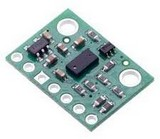
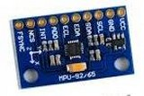
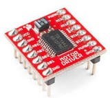

# [Web GPIO](https://github.com/browserobo/WebGPIO) and [Web I2C](https://github.com/browserobo/WebI2C)
API specifications that allows WebApps to use devices connected to GPIO or I2C on a single board computer.
Specifications are edited by [Browsers and Robotics CG](https://www.w3.org/community/browserobo/).

# [CHIRIMEN Project](https://chirimen.org)
CHIRIMEN is an open source software and open source hardware community.　They are developing the environment where various electronic parts and devices can be operated from WebApps. The core of the implementations are APIs for GPIO and I2C.

They are also developing [learning/tutorial materials](https://tutorial.chirimen.org) for beginners of WebApps and IoT technology.

## Activity intention
Rather than practical, for prototyping and learning materials.

However, such educational board computers and their use cases have a huge market for both [Raspberry PI](https://www.raspberrypi.org/) and [micro:bit](https://microbit.org/), so it makes sense to make them web-friendly.

# Implementations
There are several implementations for single board computers.

Except for B2G, WebI2C and WebGPIO are implemented by polyfills.

## [CHIRIMEN for Raspberry PI3](https://github.com/chirimen-oh/chirimen-raspi3)
Localhost Node server provides GPIO and I2C pin services. Polyfill on the browser provides WebGPIO and I2C by communicating with the Node server via WebSocket. Everything works on [Raspberry PI3](https://www.raspberrypi.org/).

## [CHIRIMEN with micro:bit](https://github.com/chirimen-oh/chirimen-micro-bit)
The polyfill on the browser operates the [micro:bit](https://microbit.org/) pins via Web Bluetooth. A program that provides GPIO and I2C pin operations via BLE is implemented on micro:bit. WebApps runs on a browser on a PC or smartphone.

Instead of Web Bluetooth, Implementation via Web USB is also planned.

## [CHIRIMEN with ty51822r3](https://github.com/chirimen-oh/chirimen-TY51822r3)
[TY51822r3](https://os.mbed.com/platforms/Switch-Science-mbed-TY51822r3/) is mbed single board computer using Nordic Semiconductor's [nRF51822](https://www.nordicsemi.com/Products/Low-power-short-range-wireless/nRF51822). The structure is almost similar to CHIRIMEN with micro: bit.

## [CHIRIMEN on B2G Open Source Hardware Single Board Computer](https://github.com/chirimen-oh/release/releases)
WebGPIO and WebI2C are implemented natively on B2G.
The community designed an open source hardware board computer designed for Boot to Gecko (an open source version of Firefox OS). Board computer production has already ended.

# Demos / Examples

- https://www.facebook.com/groups/chirimen/
- https://www.facebook.com/100024271182293/videos/579375019548199/
- https://www.youtube.com/watch?v=YVhiD-F9RH0
- https://www.facebook.com/100024271182293/videos/579375019548199/
- https://www.facebook.com/100024271182293/videos/pcb.578766219609079/578765122942522/?type=3&ifg=1&__tn__=HH-R&eid=ARAfMdVUfkmCGgcYKbeHdDyeli0nSRahErQPdoRG_F6zDvajTU2CWOHS1H8N7djCngPQGSrl_zDZrxCU
- https://www.facebook.com/100024271182293/videos/pcb.578494442969590/578474022971632/?type=3&theater&ifg=1
- https://www.facebook.com/100024271182293/videos/572523700233331/UzpfSTEwMDAwNDQ1MDQ3NTgwOTpWSzoxNzI3OTA4NTQ3NTEwNjk3/

# Pre-prepared libraries for various Devices / Parts

As learning materials for beginners, the community has been developing drivers / libraries for various devices, especially for I2C devices. Since it is necessary to develop after understanding the specifications of individual I2C devices, it is difficult for beginners.

They are javascript libraries using WebI2C. Therefore, it is common to all board computers (RPi3, micro: bit etc) under CHIRIMEN (WebI2C) environment.

There are already over thirty drivers for well-known parts/devices available for a few dollars from amazon/ebay/aliexpress.

## I2C Devices

|Category|Device|Picture|
|-|-|-|
|Analog to Digital|[ADS1015](https://chirimen.org/chirimen-raspi3/gc/top/examples/#I2C-ADS1015)||
|↑|[ADS1115](https://chirimen.org/chirimen-raspi3/gc/top/examples/#I2C-ADS1115)||
|ADC and DAC|[PCF8591](https://chirimen.org/chirimen-raspi3/gc/top/examples/#I2C-PCF8591)||
|Temperature|[ADT7410](https://chirimen.org/chirimen-raspi3/gc/top/examples/#I2C-ADT7410)||
|Thermo Graphy|[AMG8833](https://chirimen.org/chirimen-raspi3/gc/top/examples/#I2C-AMG8833)||
|Temperature, Pressure, Humidity|[BME280](https://chirimen.org/chirimen-raspi3/gc/top/examples/#I2C-BME280)||
|Temperature, Pressure|[BMP180](https://chirimen.org/chirimen-raspi3/gc/top/examples/#I2C-BMP180)||
|Temperature, Pressure|[BMP280](https://chirimen.org/chirimen-raspi3/gc/top/examples/#I2C-BMP280)||
|Laser Ranging Sensor|[GP2Y0E03](https://chirimen.org/chirimen-raspi3/gc/top/examples/#I2C-GP2Y0E03)||
|Time-of-flight distance sensor|[VL53L0X](https://chirimen.org/chirimen-raspi3/gc/top/examples/#I2C-VL53L0X)||
|Gesture Sensor|[Grove-Gesture](https://chirimen.org/chirimen-raspi3/gc/top/examples/#I2C-Grove-Gesture)||
|Light Sensor|[Grove-Light](https://chirimen.org/chirimen-raspi3/gc/top/examples/#I2C-Grove-Light)||
|OledDisplay|[Grove-OledDisplay](https://chirimen.org/chirimen-raspi3/gc/top/examples/#I2C-Grove-OledDisplay)||
|Touch Sensors|[Grove-Touch](https://chirimen.org/chirimen-raspi3/gc/top/examples/#I2C-Grove-Touch)||
|Color Sensor|[S11059](https://chirimen.org/chirimen-raspi3/gc/top/examples/#I2C-S11059)||
|Ultraviolet (UV) light sensor |[VEML6070](https://chirimen.org/chirimen-raspi3/gc/top/examples/#I2C-VEML6070)||
|Accelerometer|[Grove-Accelerometer](https://chirimen.org/chirimen-raspi3/gc/top/examples/#I2C-Grove-Accelerometer)||
|Accelerometer + Gyroscope|[MPU6050](https://chirimen.org/chirimen-raspi3/gc/top/examples/#I2C-MPU6050)||
|Gyro + Accelerometer + Compass|[MPU9250](https://chirimen.org/chirimen-raspi3/gc/top/examples/#I2C-MPU9250)||
|Addressable full-color LED|[NEOPIXEL](https://chirimen.org/chirimen-raspi3/gc/top/examples/#I2C-NEOPIXEL_I2C)||
|↑ driver board|NEOPIXEL_I2C||
|Multi-channel PWM/Servo/LED driver|PCA9685||
|↑|[PCA9685 Servo](https://chirimen.org/chirimen-raspi3/gc/top/examples/#I2C-PCA9685)||
|↑|[PCA9685 PWM](https://chirimen.org/chirimen-raspi3/gc/top/examples/#GPIO-I2C-PWMHBridge-1)||

## GPIO Parts / Devices
|Category|Device|Picture|
|-|-|-|
|[LED](https://chirimen.org/chirimen-raspi3/gc/top/examples/#GPIO-Blink)|LED||
|[Switch](https://chirimen.org/chirimen-raspi3/gc/top/examples/#GPIO-Button)|Switch||
|[DC Motor](https://tutorial.chirimen.org/raspi3/section1#led--)|Geared Motor||
|[Full Bridge Motor Driver](https://chirimen.org/chirimen-raspi3/gc/top/examples/#GPIO-HBridge)|L298N||
|↑|L9110S||
|↑|MX1508||
|↑|TB6612FNG||
|[Pyro electric Sensor](https://chirimen.org/chirimen-raspi3/gc/top/examples/#GPIO-pirSensor)|||

# Discussion
- The CHIRIMEN community seems to be happy with the polyfill implementations, is that okay?
- Are these features worth the W3C recommendation process? Here, polyfills are considered a kind of implementation in the W3C recommendation process.
